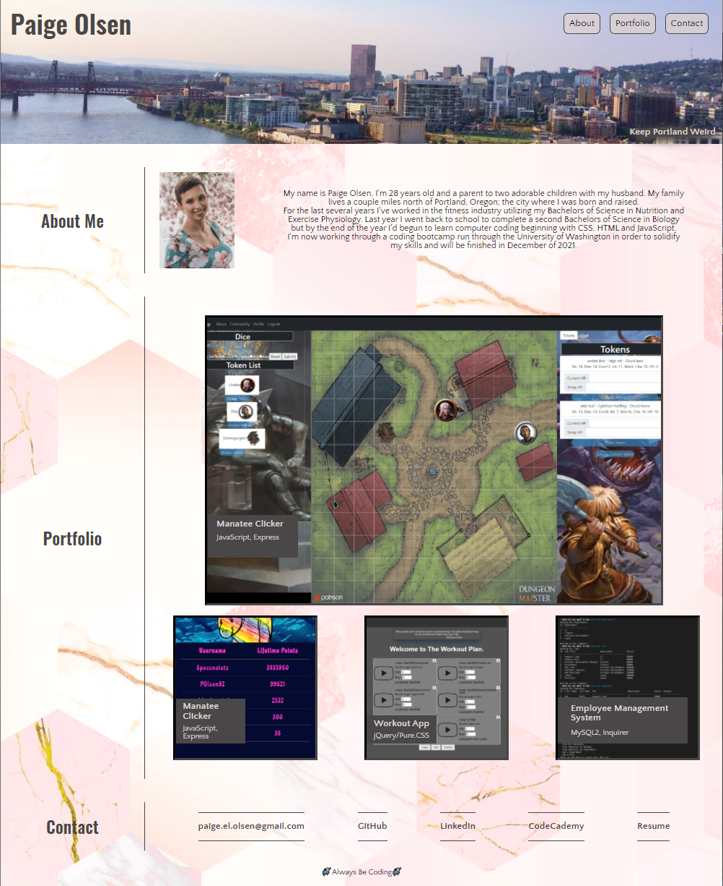

# 08 Profile Update

<pre>
	For this project I updated the original profile I created a couple weeks ago along with updating my 
Github and LinkedIn profiles and my resume.
	Within the updates to my profile I switched my background photo and adjusted the work's sections to 
feature project 1 in this course along with 3 other homework assignments. For the work features the photos 
transform upon hover and when clicked they redirect the user to the github repositories. 
	Within the github repositories any user can view a brief description of the project to the right of the
page and a link to the deployed website below. If someone scrolls through the ReadMe's they will also see
that I have updated the repos to include a 'Credits', 'License' and 'Creator' section at the bottom. 
	If a user were to scroll to the bottom of the profile they can find a buttom called 'Resume' which will
redirect the user to a downloaded pdf file of my resume. For the updates to my resume I added a technical 
skills section which lists the certifications I've completed through Codecademy and below that there is a
projects section. This section lists my first project in this program along with 2 homeworks. For each, 
there is a brief description and a GitHub link below.
	If someone were to utilize the other links to my GitHub profile they will see a brief personal 
description along with the programming languages I have been learning and 6 pinned projects that each have 
descriptions to be viewed. In my LinkedIn profile there is a filled in 'About' section along with all of my
work experience, education and coding certifications through CodeCademy. 

</pre>

## Homework Requirements

* Updated portfolio featuring Project 1 and two exemplary homework assignments.

* Updated GitHub profile with pinned repositories featuring Project 1 and two exemplary assignments.

* Updated resume

* Updated LinkedIn profile

## ScreenShot of Profile

## Credits
Built with [HTML](https://html.spec.whatwg.org/) and CSS

Fonts from [Google Fonts](https://fonts.google.com/)

Deployed with GitHub

Link to the Deployed Site: [Personal Profile](polsen-92.github.io/portfolio_2/)

## License

MIT license 
Copyright © 2020

## Creator

  
Paige Olsen
[Github](https://github.com/POlsen-92) ,
[LinkedIn](https://www.linkedin.com/in/paige-olsen-2aba9685/)